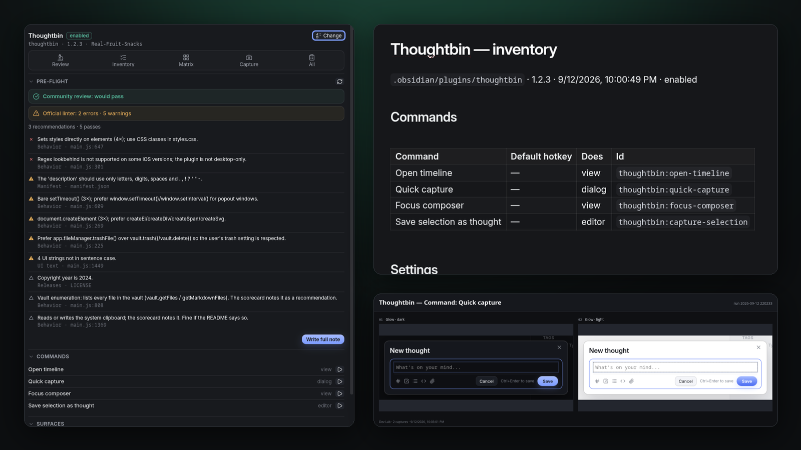
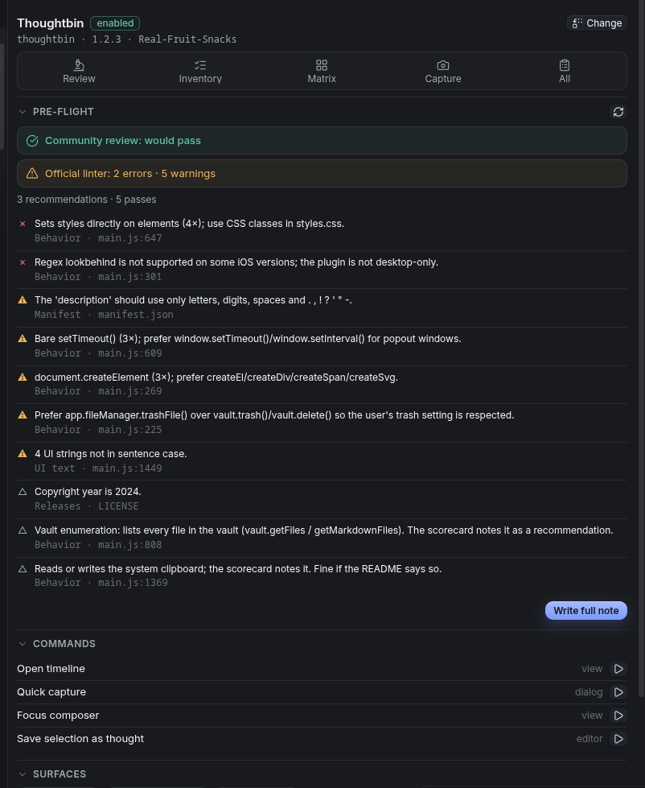
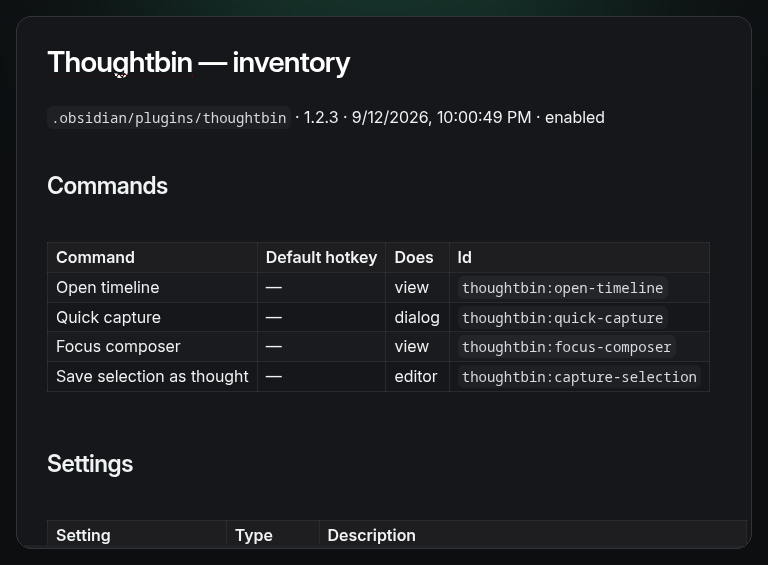
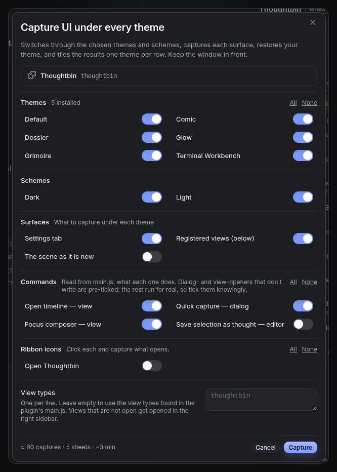
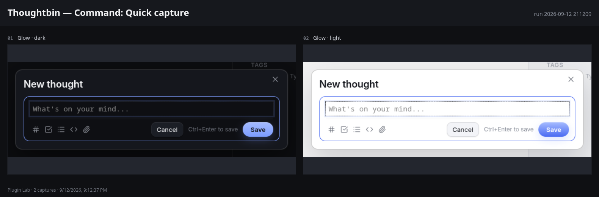

# Dev Lab

**Ship a plugin that passes review the first time.** Dev Lab reads an installed plugin's `main.js`, `styles.css` and `manifest.json` and tells you what the community review will say and what the official linter would flag — with the rule id, the file and the line. Then it inventories the plugin's commands, settings and surfaces, and captures its UI under every theme you have installed, in dark and light.

[](https://real-fruit-snacks.github.io/obsidian-plugin-lab/)
[](https://github.com/Real-Fruit-Snacks/obsidian-plugin-lab/releases/latest)
[](LICENSE)



It's the twin of [Theme Lab](https://github.com/Real-Fruit-Snacks/obsidian-theme-lab): the same panel, the same capture engine, aimed at plugin authors instead of theme authors. It was built after a first release failed review over a word in the manifest description.

## What it does

### Pre-flight review

Pick a plugin and get a scorecard note with two verdicts that are kept separate on purpose:

- **Community review** — the gate for the directory. Only rules that actually block a listing count here: the manifest words the review rejects, a malformed version, obfuscation, analytics SDKs.
- **Official linter** — [eslint-plugin-obsidianmd](https://github.com/obsidianmd/eslint-plugin), the guideline linter reviewers point people to. Dev Lab mirrors 35 of its 40 rules as static checks, with the linter's own severities and its brand and acronym lists for sentence case. The five it can't do need a TypeScript type-checker.

Every finding carries its rule id linked to the official rule doc, the file and the line. Sections match the review scorecard: Manifest, Releases, Network, Behavior, CSS, UI text. The note's front matter carries `blocking`, `lint_errors` and `warnings`, so a Dataview table over `Dev Lab/` is a dashboard.

**Review every installed plugin** writes a full note for each plugin and a summary table linking to them — worst first.



The engine masks comments, regex literals and string contents before scanning, so a plugin that *mentions* `eval` in a message doesn't get flagged for it. It was calibrated against a dozen listed plugins until its community-review verdict matched their real scorecards.

### Accessibility audit

The review reads the code; the audit watches what the code renders. **Audit** opens the plugin's settings tab, its registered views and its safe commands — in dark and light — and probes the DOM that appears: an icon-only button with no accessible name, a control the keyboard cannot reach, a focus ring that never becomes visible, a click target under 24 × 24 px, text below 4.5:1 against its resolved background under the theme you're running, plus the usual ARIA and structure mistakes.

It writes a note grouped by rule, each row naming the surface, the scheme and the element. The panel carries the result as a third verdict row beside the two review verdicts. It is advice, not a listing gate — the community review does not check any of this, which is rather the point.

### Inventory

One note: every command with its current hotkey and what it does (read from the code: opens a dialog, opens a view, needs an editor, writes files, uses the network), every setting in source order with its type and description, headings, ribbon icons, views, code-block processors, URI handlers, menu hooks, dialog classes, the keys stored in `data.json`, and a README-ready snippet.



### UI under every theme

The matrix dialog lists your installed themes (plus the default), dark and light, and the plugin's surfaces: its settings tab, its registered views, its ribbon icons, each of its commands, and "the scene as it is now". Commands are labelled with what the code says they do, and the ones that open something without writing anything are pre-ticked; the rest run for real, so you tick them knowingly. For each surface it switches theme and scheme, fires the surface, captures whatever appears — modal, prompt, suggestion list, menu, popover, notice or view — framed tightly, closes it, and tiles the results one theme per row. Your theme and scheme are restored afterwards. Anything that produced no UI is listed in the run's `Matrix.md` rather than silently skipped.





### The panel

A right-sidebar panel with the target plugin, the five tools, a live pre-flight (re-checked on demand, without writing anything), the accessibility verdict, the plugin's commands with a run button, its surfaces as chips that open them, and its review, inventory and matrix notes.

## Install

**Community plugins** — Settings → Community plugins → Browse → search "Dev Lab".

**Manually** — download `main.js`, `styles.css` and `manifest.json` from the [latest release](https://github.com/Real-Fruit-Snacks/obsidian-plugin-lab/releases/latest) into `<vault>/.obsidian/plugins/plugin-lab/`, then enable it under Community plugins.

Desktop only: captures use Electron's `capturePage`.

## Use

1. Open the panel (ribbon icon or **Dev Lab: Open panel**) and pick the plugin you're working on. If its folder is a clone of the repository, the review also checks `versions.json`, `README.md` and `LICENSE`.
2. Read the **Pre-flight** section as you edit; **Re-check** after a reload. When it's clean, **Write full note** and keep it with the release.
3. **Inventory** before you write the README; paste the snippet.
4. **Matrix** before you publish screenshots: settings tab, views and the safe commands under the themes your users are likely to have.
5. **Review every installed plugin** now and then — it's a quick way to see which of your dependencies would fail today's review, and a fair sample of what the rules look like on other people's code.

## Where things go

```
Dev Lab/
  Thoughtbin/
    Review 2026-09-12 213349.md
    Inventory 2026-09-12 211200.md
    2026-09-12 211209/        one folder per matrix run
      Matrix.md
      sheets/
      shots/                  full window, -focus (the element), -hero (1920 wide)
  Summary 2026-09-12 213349.md
  Scratch.md                  a note editor commands can run in; safe to delete
```

## What the review does and doesn't cover

- Mirrored from the official linter: manifest schema and description format, forbidden words, the five command rules, default hotkeys, detach-leaves, forbidden `style`/`link` elements, inline styles, `navigator` platform detection, regex lookbehind on non-desktop plugins, Node modules, `globalThis`, bare timers, `document.createElement`, `vault.trash`/`delete`, `localStorage` language, `instanceof` on DOM types, the copied `TextInputSuggest`, two-argument `Object.assign`, iterating all files to find one, hardcoded `.obsidian` paths, editor drop/paste handlers, sample code and sample class names, view references in the plugin, the plugin as a render component, the three settings-heading rules, `validate-license`, `no-console` with the recommended allow-list, and `ui/sentence-case` with the official brand and acronym lists (plus the reviewed plugin's own name).
- Not covered: `no-unsupported-api` and `no-tfile-tfolder-cast` (need types), npm dependency audits, and anything the review checks against the GitHub release itself (assets, attestation, tag).
- From the community scorecard: manifest words, `!important`, obfuscation, network disclosure, analytics SDKs, vault enumeration, clipboard, `innerHTML`.

It reads code as text, so it's an approximation. When it's wrong about a rule, the [issue template](https://github.com/Real-Fruit-Snacks/obsidian-plugin-lab/issues/new/choose) asks for the review line and the code it points at.

## Contributing

See [CONTRIBUTING.md](CONTRIBUTING.md). No build step: `main.js`, `styles.css`, `manifest.json`. Every review rule has a case in the test harness.

## Notes

Formerly "Plugin Lab" — the directory doesn't allow that word in a plugin name. The plugin id is still `plugin-lab`, so existing installs and hotkeys keep working.

## License

[MIT](LICENSE).
